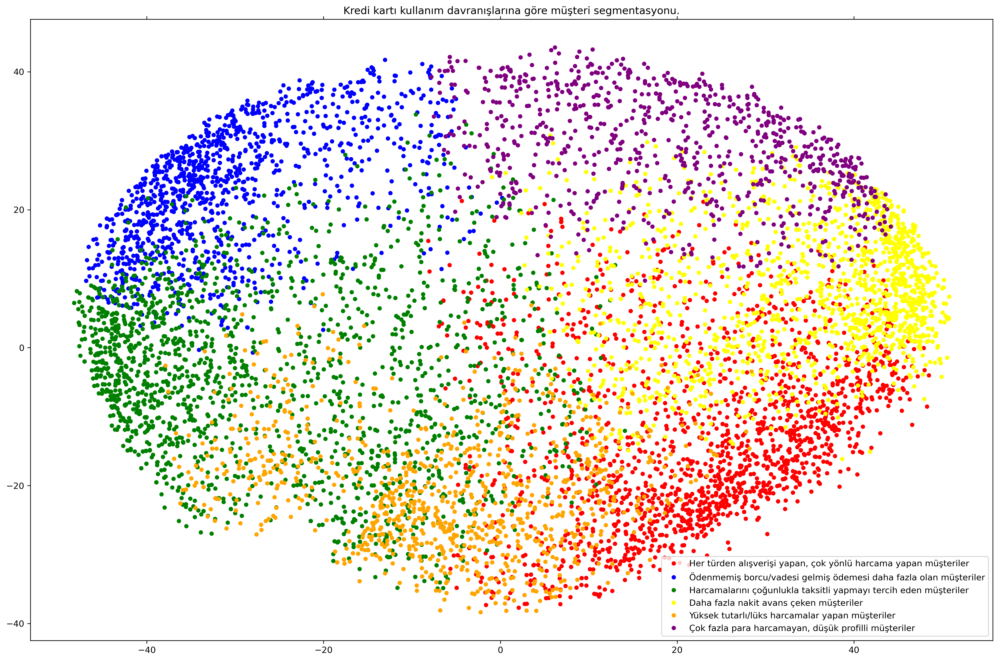

# Kredi Kartı Kullanıcı Segmentasyonu (K-Means Clustering)

* Bu proje, bir bankanın kredi kartı müşterilerini harcama alışkanlıklarına göre segmentlere ayırmak amacıyla oluşturulmuştur. 9000'e yakın müşterinin yaklaşık 6 aylık verisi analiz edilmiştir.

# Veri Ön İşleme ve Analiz

* Missing Values: Eksik veriler istatistiksel yöntemlerle tamamlanmıştır.

* Feature Engineering: Aykırı değerlerin model üzerindeki etkisini azaltmak için sayısal değişkenler kategorik aralıklara dönüştürülmüştür.

* Standardization: Tüm özellikler StandardScaler ile ölçeklendirilmiştir.

* Dimensionality Reduction: 2 boyutlu görselleştirme için PCA (Principal Component Analysis) kullanılmıştır.

# Kullanılan Teknolojiler

* Python (Pandas, Numpy)

* Scikit-Learn (KMeans, PCA, StandardScaler)

* Görselleştirme: Matplotlib, Seaborn, ydata-profiling

# Sonuç

* Müşteriler, harcama sıklıkları ve kredi limit kullanım durumlarına göre 6 farklı segmente ayrılmıştır. Bu segmentasyon, pazarlama stratejilerinin (kampanyalar, limit artışları) kişiselleştirilmesine olanak tanır.
